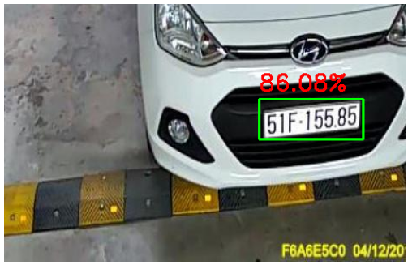
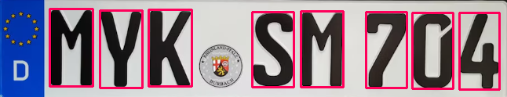
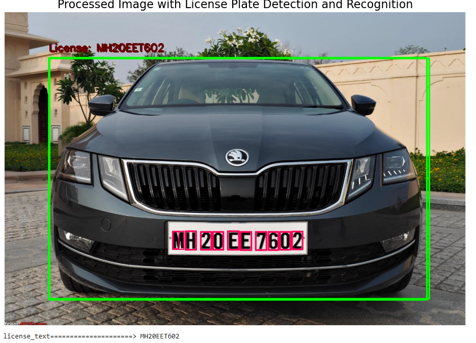

# Vehicle and License Plate Detection and Recognition with Character Recognition

This project implements a pipeline for detecting vehicles and license plates in videos, followed by character recognition using YOLOv8 and Vision Transformer (ViT). The output is a processed video with bounding boxes and recognized license plate text displayed on each frame.

## Features

- **Vehicle Detection**: Uses YOLOv8 for detecting vehicles (e.g., cars, buses).
- **License Plate Detection**: Uses YOLOv8 with custom-trained weights (`yolo-best.pt`) for license plate detection.
- **Character Recognition**: Implements OCR using Vision Transformer (ViT) with `num_labels=36` for recognizing alphanumeric characters.
- **Output Video**: Generates a video (`output_video1.avi`) with annotations, including detected vehicles and license plate text.

## Installation

### Prerequisites

1. **Python Environment**: Ensure you have Python 3.7+ installed.
2. **Dependencies**: Install required libraries:

   ```bash
   pip install torch torchvision transformers ultralytics opencv-python pillow numpy matplotlib
   ```

3. **Directory Structure**:
   - Place all Vision Transformer-related codes in the `VIT` folder.
   - Testing images should be located in the `test_data` folder.
   - Trained weights (`yolo-best.pt` and `yolov8s.pt`) should be in the `trained_weight` folder.

### Directory Setup

Your project directory should look like this:

```plaintext
.
├── VIT/                      # Contains all ViT-related codes and scripts
│   ├── OCR_VIT.py         # Vision Transformer model checkpoint
│   ├── test_OCR # ViT scripts
│   └── ...
├── test_data/                # Contains test images
│   ├── test_image1.jpg
│   ├── test_image2.jpg
│   └── ...
├── trained_weight/           # Contains YOLO and VIT trained weights
│   ├── yolo-best.pt          # License plate YOLO model
│   ├── yolov8s.pt            # Vehicle YOLO model
│   └── vit_model.pth
├── Yolo_and_VIT.ipynb   # Main script for detection and recognition
├── test.mp4                  # Input video
├── output_video1.avi         # Processed output video
└── ...
```

### Pre-trained Models

- **YOLO Models**:
  - `yolo-best.pt`: Custom-trained YOLO model for license plate detection.
  - `yolov8s.pt`: YOLOv8 model for vehicle detection.
- **Vision Transformer**:
  - `vit_model.pth`: Vision Transformer checkpoint trained for OCR (character recognition).

## Usage

### Testing with Images

Test images can be placed in the `test_data` folder. Use the provided scripts in the `VIT` folder to perform OCR testing on license plates.

## Code Overview

### Pipeline

1. **Vehicle Detection**:
   - YOLOv8 detects vehicles in each frame.
   - Filters detections based on class IDs and confidence scores.

2. **License Plate Detection**:
   - Uses a custom YOLO model (`yolo-best.pt`) to identify license plates within detected vehicles.
   - 

3. **Character Recognition**:
   - Each license plate is processed using a Vision Transformer (ViT) to recognize characters.
   - Detected text is drawn on the frame.
   - 

4. **Output**:
   - The processed frames are saved as a new video (`output_video1.avi`).
   - 

### Functions

- `VITCharRecognition(img)`: Performs character recognition using ViT.
- `auto_canny(image, sigma=0.33)`: Adaptive edge detection.
- `opencvReadPlate(img)`: Processes a license plate image and extracts characters.

### Example

Here’s how a frame from the processed video looks:

- Bounding boxes around vehicles and license plates.
- Recognized license plate text displayed above the bounding box.

## Dependencies

The project uses the following Python libraries:
- [PyTorch](https://pytorch.org/): For Vision Transformer and deep learning models.
- [Ultralytics](https://github.com/ultralytics/ultralytics): For YOLO models.
- [OpenCV](https://opencv.org/): For video processing and image manipulation.
- [Transformers](https://huggingface.co/docs/transformers/): For the ViT model.
- [NumPy](https://numpy.org/): For numerical operations.

## Dataset for VIT and trained weights
https://drive.google.com/file/d/1jGeYAhk7br6UraK5X0JAiGKHiaIRl8vs/view?usp=drive_link
https://drive.google.com/drive/folders/1QryI_8Wr-cSjL4yKJStwm-x1WLtEH2Bj?usp=drive_link
